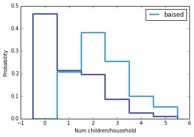

[Think Stats Chapter 3 Exercise 1](http://greenteapress.com/thinkstats2/html/thinkstats2004.html#toc31) (actual vs. biased)

>> When surveying children, it appears that families with many children are more likely to appear in the sample. This is due to the biased information of asking families with at least one child. First, a probability mass function is calculated from the female respondent data. This information is used to create a biased pmf due to oversampling given the respondents were proportional to the number of children. The biased function is:

```
    def BiasPmf(pmf):
        new_pmf = pmf.Copy(label=label)

            for x, p in pmf.Items():
                new_pmf.Mult(x, x)
        
        new_pmf.Normalize()
        return new_pmf
```
>> We compare the female respondent data to a biased calculation in the pmfs plotted below: 



>> We see that the actual response has a peak at 0 children, and tails off towards the right. The biased distribution has a peak at two children and has a smaller tail towards the right. When we compare means of the distributions, we find that for actual the mean is 1.02 children, and for the biased distribution it is 2.40 children. This shows how important oversampling bias is in altering probability disrtibution.
