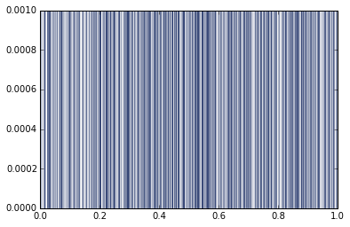
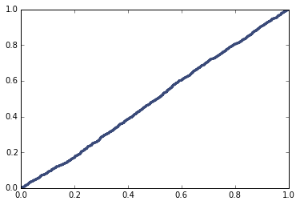

[Think Stats Chapter 4 Exercise 2](http://greenteapress.com/thinkstats2/html/thinkstats2005.html#toc41) (a random distribution)

>> To examine the randomness of the function random.random(), we look at the probability mass function of a sample of size 1000. The plot yields little to no information. There's an almost infinite (to the limit of the machine/function) possibility of unique numbers between 0 and 1. Thus the pmf just shows which numbers were selected each with a probability of 0.001.

>> It is easier to determine the trend by looking at the cumulative distribution function. We see a straight line trend with a slope of 1. This coincides precisely with the uniformity of the sample. The probability of obtaining a unique number should be the same within the interval, meaning that the slope would be constant. For an interval of 0 to 1, the slope would be equal to 1. Thus we can conclude that the random.random() function does produce a uniform distribution.

