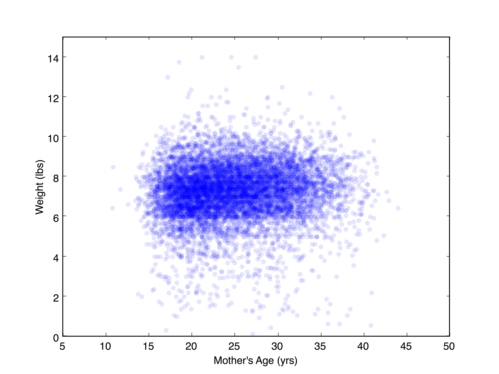
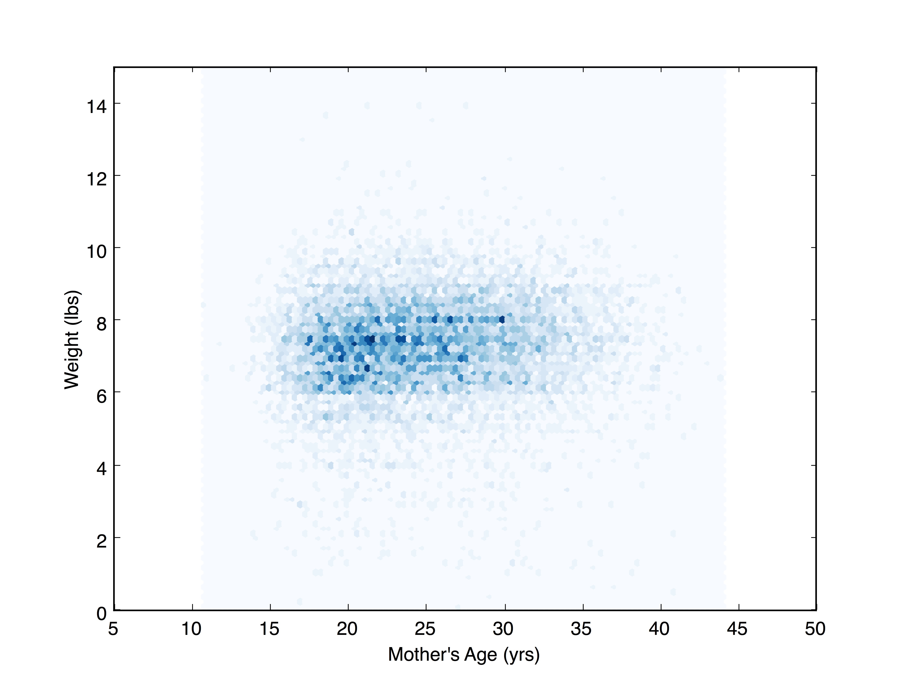
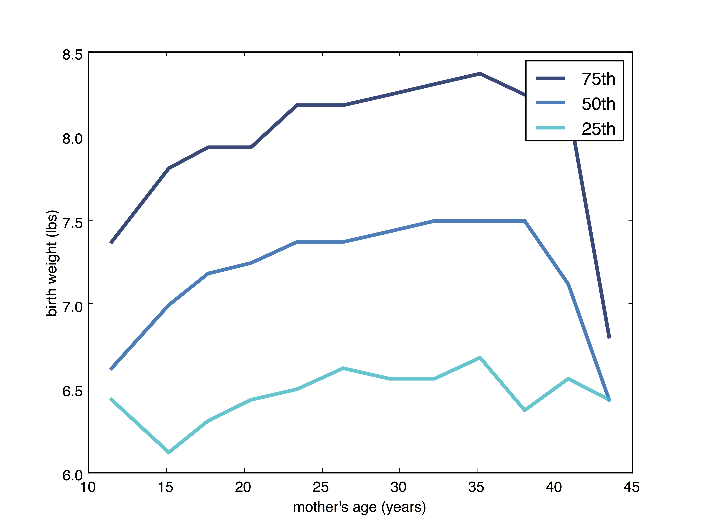
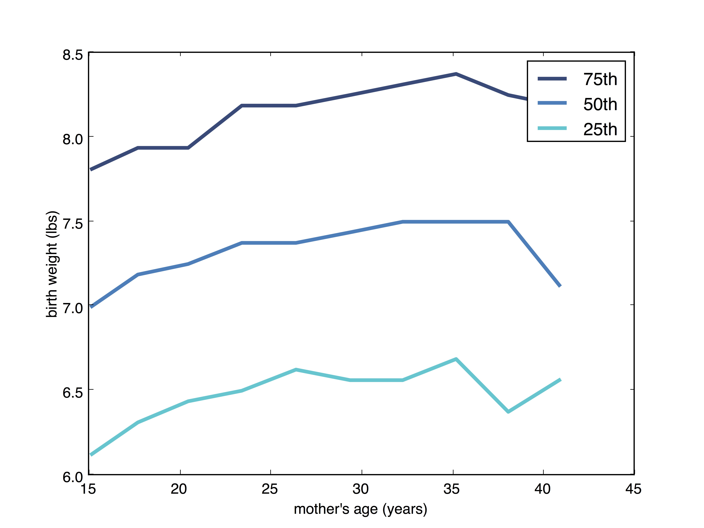

[Think Stats Chapter 7 Exercise 1](http://greenteapress.com/thinkstats2/html/thinkstats2008.html#toc70) (weight vs. age)

>> Using data from the National Survey of Family Growth, we can evaluate the relationship between mother's age at pregnancy and the birth weight of a child. Two plots are created from the data. The first plot is a scatter plot using transparency to indicate density, and the second plot is a hexbin plot. Both show a similar representation of the data as this is a mid sized data set. With more values, a hexbin would become more appropriate to determine the shape of the relationship.




>> The scatter plot shows a weak relationship between the variables. We see that there is more density towards the center of the plot. We also observe that Pearson's correlation is 0.069 and Spearman's correlation is 0.095. This suggests a linear correlation is extremely weak, and may be influenced by outliers. This could also be indicative of a non-linear relationship. 
>> Another way to visualize the data is to bin one variable, and plot the percentile of the other. For each bin of age, a mean age and cdf of weight is produced. Age is plotted against the 75th, 50th, and 25th percentile of weight below:



>> We see that the trend is not present on the outer values of age, so we can focus the plot by removing those bins. This makes the relationship clearer and still looks at 99% of the data.



>> There is a steeper slope in weights when looking between ages 15-25. For older ages, there is a slower rate of increase, and the plot takes on a more curved shape. This, along with the Pearson and Spearman correlation values, suggests a non-linear relationship between age and birth weight.

>> Below is the code used to create these plots:

```
from __future__ import print_function

import sys
import numpy as np

import nsfg
import thinkplot
import thinkstats2


def MakeScatterPlot(ages, weights, alpha=1):
    thinkplot.Scatter(ages, weights, alpha=alpha)
    thinkplot.Save(root='chap07exscatter1',
                   formats=['jpg'],
                   xlabel="Mother's Age (yrs)",
                   ylabel='Weight (lbs)',
                   xlim=[5, 50],
                   ylim=[0, 15],
                   legend=False)


def MakeHexBin(ages, weights, bins=None):
    thinkplot.HexBin(ages, weights, bins=bins)
    thinkplot.Save(root='chap07exscatter2',
                   formats=['jpg'],
                   xlabel="Mother's Age (yrs)",
                   ylabel='Weight (lbs)',
                   xlim=[5, 50],
                   ylim=[0, 15],
                   legend=False)


def BinnedPercentiles(df):
    bins = np.arange(10, 48, 3)
    indices = np.digitize(df.agepreg, bins)
    groups = df.groupby(indices)

    ages = [group.agepreg.mean() for i, group in groups][1:-1]  # Removing the first and last groups
    cdfs = [thinkstats2.Cdf(group.totalwgt_lb) for i, group in groups][1:-1]  # Removing first and last groups

    thinkplot.PrePlot(3)
    for percent in [75, 50, 25]:
        weights = [cdf.Percentile(percent) for cdf in cdfs]
        label = '%dth' % (percent)
        thinkplot.Plot(ages, weights, label=label)

    thinkplot.Save(root='chap07exscatter4',
                   formats=['jpg'],
                   xlabel="mother's age (years)",
                   ylabel='birth weight (lbs)',
                   legend=True)


def main(script):
    preg = nsfg.ReadFemPreg()
    live = preg[preg.outcome == 1]
    live = live.dropna(subset=['agepreg', 'totalwgt_lb'])
    ages = live.agepreg
    weights = live.totalwgt_lb
    MakeScatterPlot(ages, weights, alpha=0.1)
    MakeHexBin(ages, weights)
    BinnedPercentiles(live)
    print ("Pearson's Correlation: ", thinkstats2.Corr(ages, weights))
    print ("Spearman's Correlation: ", thinkstats2.SpearmanCorr(ages, weights))

if __name__ == '__main__':
    main(*sys.argv)
```
